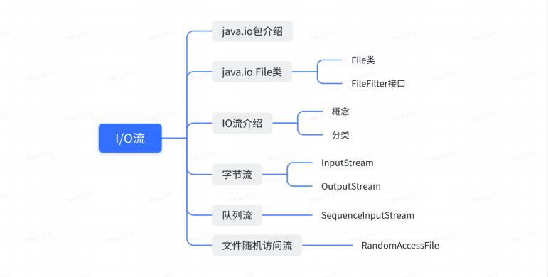
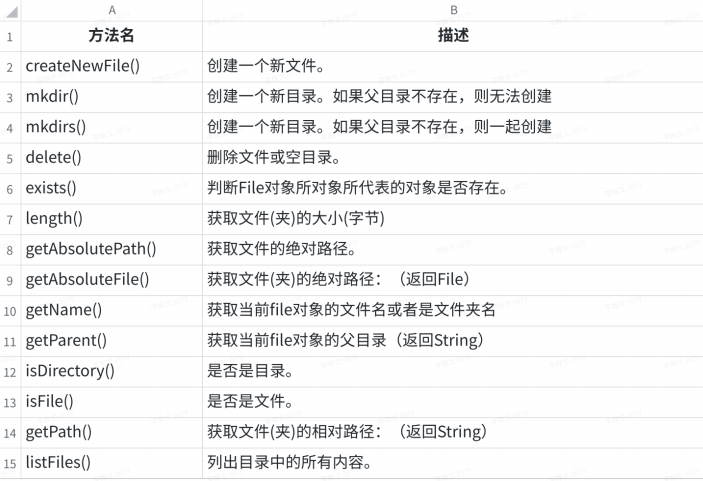

# IO流

简介:



## 1. File类

表示操作系统磁盘上的文件或者文件夹

路径:

- 相对路径: 相当于当前工程的根路径
- 绝对路径: 在磁盘上的完整路径

常用方法:



## 2. 字节流(重点)

### 2.1 字节抽象类

InputStream:字节输入流

- public int read(byte[] b){}

OutputStream:字节输出流

- public void write(int n){}

### 2.2 文件字符流[重点]

FileOutStream:(文件字节输入流)

- out.write(b,off,len)

参数1: byte[] 字节数组

参数2：从buffer的第几个位置开始读取

参数3：一共读取多少到新文件中去

FileInputStream:(文件字节输出流)

- file.read(byte[] b)

### 2.3 注意点

1、在使⽤⽂件输出流的时候如果⽂件不存在会⾃动创建，但是要保证其⽗⽬录存在 

2、在使⽤⽂件输出流的时候，如果想要向⽂件中追加内容，那么需要将构造参数append设置为true 

3、在使⽤IO读写的时候，读写的操作应当写在try代码块中，关闭资源的代码写在finally代码块中 

4、将IO流的创建写在try()中，这样IO流在使⽤完成之后⽆需关闭 


### 2.4 案例:文件拷贝的几种方法

#### 2.4.1字节流

```java
static void copy() {
    String src = "/Users/cuesky/Desktop/adv.mp4";
    String dest = "/Users/cuesky/Desktop/advCopy.mp4";
    try (
            // 只要括号中的组件实现了Closeable接口，JVM会自动帮程序来关闭
            // in.close() out.close()
            // 它们并非是为了释放JVM中相应的内存，因为JVM中有GC可以自动管理
            // 主要是为了.Java程序申请的硬件资源，通知它们可以释放了
            // 如果没有释放的话，会发生系统崩溃，因为比如OS一般都有同时可以打开多少个文件的限制（65536）
            InputStream in = Files.newInputStream(Paths.get(src));
            OutputStream out = new FileOutputStream(dest);
            MyResource r = new MyResource()
    ) {
        // int b = in.read();// 以字节为单位读取文件
        // out.write(b); // 以字节为单位输出数据到文件中
        byte[] buffer = new byte[1024]; // 以1kb为缓冲来读取
        int len; // 用来记录in实际读取的文件长度
        while ((len = in.read(buffer)) != -1) {
            // 参数2：从buffer的第几个位置开始读取
            // 参数3：一共读取多少到新文件中去
            out.write(buffer, 0, len);
        }
    } catch (IOException e) {
        throw new RuntimeException(e);
    }
}
```

#### 2.4.2 缓冲流

(又称:节点流,处理流)(**不能直接和文件打交道**)

```java
static void bufferd() {
    String src = "/Users/cuesky/Desktop/adv.mp4";
    String dest = "/Users/cuesky/Desktop/advCopy.mp4";
    try (
            InputStream in = new FileInputStream(src);
            BufferedInputStream bis = new BufferedInputStream(in); // 带内部缓冲的输入流
            OutputStream out = new FileOutputStream(dest);
            BufferedOutputStream bos = new BufferedOutputStream(out);
    ) {
        byte[] buffer = new byte[1024];
        int len;
        while ((len = bis.read(buffer)) != -1) {
            bos.write(buffer, 0, len);
        }
    } catch (IOException e) {
        e.printStackTrace();
    }
}
```

#### 2.4.3 字符流

```java
// 字节流能否操作这个以字符为单位记录信息的文件呢？ 可以的，但是比直接用字符流操作速度要慢
// 对于二进制的文件，能否用字符流来操作呢？ 不可以
static void charWrite() {
    String src = "/Users/cuesky/Desktop/a1.txt";
    Scanner scanner = new Scanner(System.in); // 直到用户输入q，就退出，同时把前面输入给控制台的所有信息，都记录到文件中去
    try (
            BufferedWriter writer = new BufferedWriter(new FileWriter(src, true));
            Reader reader = new FileReader("");
            BufferedReader br = new BufferedReader(reader)
    ) {
        // writer.newLine(); // 写一个空行
        String content;
        while (!(content = scanner.next()).equals("q")) {
            writer.write(content + "\r\n");
        }
    } catch (IOException e) {
        e.printStackTrace();
    }
}
```


